# Architecture du Projet - Choix Techniques Détaillés

## 🏗️ Vue d'ensemble de l'architecture

Ce document détaille les choix techniques et l'architecture du boilerplate full-stack. Pour une vue d'ensemble rapide, consultez le [README.md](./README.md).

## 📁 Structure du Monorepo

```
boiler-done/
├── apps/
│   ├── client/              # Application React Router (Frontend)
│   │   ├── app/            # Code source React
│   │   ├── build/          # Build de production
│   │   └── public/         # Assets statiques
│   └── server/             # API Fastify (Backend)
│       ├── src/            # Code source Node.js
│       ├── dist/           # Build de production
│       └── templates/      # Templates email MJML
├── packages/
│   ├── db/                 # Base de données Drizzle ORM
│   │   ├── src/           # Schémas et migrations
│   │   └── drizzle/       # Migrations SQL
│   └── config/            # Configuration partagée
│       ├── typescript/    # Config TS partagée
│       └── eslint/        # Config ESLint partagée
└── docker-compose.yml     # Services de développement
```

## 🛠️ Choix Techniques Détaillés

### 1. **Monorepo avec Turborepo**

#### Pourquoi un Monorepo ?

**Avantages :**

- **Cohérence** : Versioning unifié des dépendances
- **Refactoring** : Changements cross-package facilités
- **CI/CD** : Builds optimisés et cache partagé
- **Developer Experience** : Scripts unifiés et configuration centralisée

#### Pourquoi Turborepo ?

**Comparaison avec les alternatives :**

| Outil         | Performance | Cache       | DX         | Maturité   |
| ------------- | ----------- | ----------- | ---------- | ---------- |
| **Turborepo** | ⭐⭐⭐⭐⭐  | Intelligent | ⭐⭐⭐⭐⭐ | ⭐⭐⭐⭐   |
| Lerna         | ⭐⭐⭐      | Basique     | ⭐⭐⭐     | ⭐⭐⭐⭐⭐ |
| Nx            | ⭐⭐⭐⭐    | Bon         | ⭐⭐⭐⭐   | ⭐⭐⭐⭐⭐ |
| Rush          | ⭐⭐⭐      | Bon         | ⭐⭐       | ⭐⭐⭐     |

**Configuration Turborepo :**

```json
{
	"ui": "tui", // Interface utilisateur moderne
	"tasks": {
		"build": {
			"dependsOn": ["^build"], // Dépendances entre packages
			"inputs": [".env*"] // Cache invalidation
		},
		"dev": {
			"cache": false, // Pas de cache pour le dev
			"persistent": true // Processus long-running
		}
	}
}
```

### 2. **Frontend : React Router v7 + Vite**

#### Évolution du Routing React

**Historique :**

- **React Router v5** : Client-side routing classique
- **React Router v6** : Hooks et composants modernes
- **React Router v7** : Full-stack avec SSR natif

#### Pourquoi React Router v7 ?

**Comparaison avec les alternatives :**

| Framework           | SSR        | Type Safety | Performance | Learning Curve |
| ------------------- | ---------- | ----------- | ----------- | -------------- |
| **React Router v7** | ⭐⭐⭐⭐⭐ | ⭐⭐⭐⭐⭐  | ⭐⭐⭐⭐⭐  | ⭐⭐⭐         |
| Next.js             | ⭐⭐⭐⭐⭐ | ⭐⭐⭐⭐    | ⭐⭐⭐⭐    | ⭐⭐⭐⭐       |
| Remix               | ⭐⭐⭐⭐⭐ | ⭐⭐⭐⭐    | ⭐⭐⭐⭐    | ⭐⭐           |
| SvelteKit           | ⭐⭐⭐⭐⭐ | ⭐⭐⭐⭐⭐  | ⭐⭐⭐⭐⭐  | ⭐⭐⭐         |

**Avantages de React Router v7 :**

- **Full-Stack** : SSR natif sans configuration
- **Type Safety** : Génération automatique des types
- **Performance** : Hydratation partielle et streaming
- **Flexibilité** : Pas d'opinion sur la structure

**Configuration Vite :**

```typescript
export default defineConfig({
	plugins: [
		tailwindcss(), // Intégration Tailwind CSS 4
		reactRouter(), // Plugin React Router v7
		tsconfigPaths(), // Support des paths TypeScript
	],
})
```

#### Stack Frontend Détaillée

**Core Technologies :**

```typescript
// Framework et Routing
- React 19.1.0          // Framework UI avec Server Components
- React Router 7.7.1    // Routing full-stack
- Vite 6.3.3           // Build tool ultra-rapide

// Styling et UI
- Tailwind CSS 4.1.4   // Utility-first CSS
- Radix UI             // Composants accessibles
- Shadcn/ui            // Design system

// State Management
- TanStack Query 5.89.0 // Server state management
- React Hook Form 7.62.0 // Form state management

// Utilitaires
- Zod 4.1.9            // Validation de schémas
- Date-fns 4.1.0       // Manipulation des dates
- Lucide React 0.544.0 // Icônes
```

### 3. **Backend : Fastify + Better Auth**

#### Pourquoi Fastify ?

**Comparaison de performance :**

| Framework   | Requests/sec | Latency | Memory | TypeScript |
| ----------- | ------------ | ------- | ------ | ---------- |
| **Fastify** | 76,000       | 0.1ms   | 12MB   | ⭐⭐⭐⭐⭐ |
| Express     | 25,000       | 0.4ms   | 20MB   | ⭐⭐⭐     |
| Koa         | 30,000       | 0.3ms   | 15MB   | ⭐⭐⭐     |
| Hapi        | 20,000       | 0.5ms   | 25MB   | ⭐⭐⭐⭐   |

**Avantages de Fastify :**

- **Performance** : 2-3x plus rapide qu'Express
- **Type Safety** : Support TypeScript natif
- **Validation** : Intégration Zod native
- **Plugins** : Architecture modulaire
- **Logging** : Logger intégré performant

**Configuration Fastify :**

```typescript
const app = Fastify({
	logger: true, // Logger intégré
	trustProxy: true, // Support proxy
	bodyLimit: 1048576, // Limite body 1MB
})
	.setValidatorCompiler(validatorCompiler) // Validation Zod
	.setSerializerCompiler(serializerCompiler) // Sérialisation optimisée
	.withTypeProvider<ZodTypeProvider>() // Type safety
```

#### Better Auth : Authentification Moderne

**Pourquoi Better Auth ?**

**Comparaison avec les alternatives :**

| Solution        | Type Safety | Modernité  | Flexibilité | Intégrations |
| --------------- | ----------- | ---------- | ----------- | ------------ |
| **Better Auth** | ⭐⭐⭐⭐⭐  | ⭐⭐⭐⭐⭐ | ⭐⭐⭐⭐⭐  | ⭐⭐⭐⭐⭐   |
| NextAuth.js     | ⭐⭐⭐      | ⭐⭐⭐⭐   | ⭐⭐⭐      | ⭐⭐⭐⭐     |
| Auth0           | ⭐⭐⭐      | ⭐⭐⭐⭐   | ⭐⭐        | ⭐⭐⭐⭐⭐   |
| Supabase Auth   | ⭐⭐⭐⭐    | ⭐⭐⭐⭐   | ⭐⭐⭐      | ⭐⭐⭐⭐     |

**Fonctionnalités Better Auth :**

```typescript
// Configuration complète
export const auth = betterAuth({
	// Base de données
	database: drizzleAdapter(db, { provider: 'pg' }),

	// Champs utilisateur personnalisés
	user: {
		additionalFields: {
			address: { type: 'string', required: false },
			city: { type: 'string', required: false },
			// ... autres champs
		},
	},

	// Authentification email/password
	emailAndPassword: {
		enabled: true,
		requireEmailVerification: true,
		sendResetPassword: async ({ user, url }) => {
			/* ... */
		},
	},

	// Vérification email
	emailVerification: {
		autoSignInAfterVerification: true,
		sendVerificationEmail: async ({ user, url }) => {
			/* ... */
		},
	},

	// Hooks personnalisés
	hooks: {
		after: createAuthMiddleware(async (ctx) => {
			if (ctx.path.startsWith('/sign-up')) {
				// Envoi email de bienvenue
			}
		}),
	},

	// Providers OAuth
	socialProviders: {
		github: {
			/* ... */
		},
	},

	// Plugins
	plugins: [
		openAPI(), // Documentation API
		stripe({
			/* ... */
		}), // Intégration Stripe
	],
})
```

### 4. **Base de Données : Drizzle ORM + PostgreSQL**

#### Pourquoi Drizzle ORM ?

**Comparaison des ORMs :**

| ORM         | Type Safety | Performance | DX         | Learning Curve |
| ----------- | ----------- | ----------- | ---------- | -------------- |
| **Drizzle** | ⭐⭐⭐⭐⭐  | ⭐⭐⭐⭐⭐  | ⭐⭐⭐⭐⭐ | ⭐⭐⭐⭐       |
| Prisma      | ⭐⭐⭐⭐    | ⭐⭐⭐      | ⭐⭐⭐⭐   | ⭐⭐⭐         |
| TypeORM     | ⭐⭐⭐      | ⭐⭐        | ⭐⭐⭐     | ⭐⭐           |
| Sequelize   | ⭐⭐        | ⭐⭐        | ⭐⭐       | ⭐⭐⭐         |

**Avantages de Drizzle :**

- **Type Safety** : Schémas TypeScript-first
- **Performance** : Requêtes SQL optimisées
- **Flexibilité** : SQL brut quand nécessaire
- **Migration** : Système de migration robuste
- **Tree Shaking** : Import sélectif

**Schéma utilisateur :**

```typescript
export const user = pgTable('user', {
	id: text('id').primaryKey(),
	name: text('name').notNull(),
	email: text('email').notNull().unique(),
	emailVerified: boolean('email_verified').default(false).notNull(),
	image: text('image'),

	// Champs personnalisés
	address: text('address').notNull(),
	city: text('city'),
	region: text('region'),
	postalCode: text('postal_code'),
	country: text('country'),
	stripeCustomerId: text('stripe_customer_id'),

	// Timestamps automatiques
	createdAt: timestamp('created_at').defaultNow().notNull(),
	updatedAt: timestamp('updated_at')
		.$onUpdate(() => new Date())
		.notNull(),
})
```

#### PostgreSQL : Base de Données Relationnelle

**Pourquoi PostgreSQL ?**

**Comparaison des bases de données :**

| DB             | ACID       | Performance | Scalabilité | Fonctionnalités |
| -------------- | ---------- | ----------- | ----------- | --------------- |
| **PostgreSQL** | ⭐⭐⭐⭐⭐ | ⭐⭐⭐⭐    | ⭐⭐⭐⭐    | ⭐⭐⭐⭐⭐      |
| MySQL          | ⭐⭐⭐⭐   | ⭐⭐⭐⭐    | ⭐⭐⭐⭐    | ⭐⭐⭐          |
| SQLite         | ⭐⭐⭐⭐   | ⭐⭐⭐      | ⭐          | ⭐⭐⭐          |
| MongoDB        | ⭐⭐       | ⭐⭐⭐      | ⭐⭐⭐⭐⭐  | ⭐⭐⭐⭐        |

**Avantages de PostgreSQL :**

- **ACID** : Transactions complètes
- **JSON** : Support natif du JSON
- **Extensions** : Écosystème riche
- **Performance** : Optimisations avancées
- **Standards** : Conformité SQL

### 5. **Paiements : Stripe Integration**

#### Architecture Stripe

**Flux de paiement :**

```mermaid
graph TD
    A[Client] --> B[Frontend React]
    B --> C[Stripe Checkout]
    C --> D[Stripe API]
    D --> E[Webhook]
    E --> F[Backend Fastify]
    F --> G[Base de données]
    F --> H[Email confirmation]
```



**Configuration Stripe :**

```typescript
// Plans configurés
export const plans = [
	{
		name: 'basic',
		priceId: 'price_1S8yuNRvGJ6lPiv4fERR99U9',
		annualDiscountPriceId: 'price_1S8yuNRvGJ6lPiv4zBKnutcI',
		limits: { projects: 3 },
	},
	{
		name: 'pro',
		priceId: 'price_1S92oIRvGJ6lPiv4zZk6Lq64',
		annualDiscountPriceId: 'price_1S92p3RvGJ6lPiv4qs1g2PyZ',
		limits: { projects: 10 },
	},
	{
		name: 'enterprise',
		priceId: 'price_1S92r0RvGJ6lPiv4ojNbb8zy',
		annualDiscountPriceId: 'price_1S92r0RvGJ6lPiv4k7DIqB9c',
		limits: { projects: 100 },
	},
]

// Webhook handler
onEvent: async (event) => {
	switch (event.type) {
		case 'checkout.session.completed': {
			// Traitement du paiement réussi
			const mailer = new ConfirmPaymentMailer()
			await mailer.send({
				to: event.data.object.customer_email,
				data: {
					order_id: event.data.object.id,
					amount: event.data.object.amount_total || 0,
					currency: event.data.object.currency || 'USD',
					// ...
				},
			})
		}
	}
}
```

### 6. **UI/UX : Radix UI + Tailwind CSS**

#### Design System Architecture

**Stack UI :**

```typescript
// Composants de base
- Radix UI             // Primitives accessibles
- Shadcn/ui            // Design system
- Tailwind CSS 4       // Utility-first CSS
- Lucide React         // Icônes cohérentes
- Next Themes          // Gestion des thèmes
```

**Configuration Shadcn :**

```json
{
	"style": "new-york", // Style de composants
	"rsc": false, // Pas de React Server Components
	"tsx": true, // Support TypeScript
	"tailwind": {
		"config": "", // Config Tailwind personnalisée
		"css": "app/app.css", // Fichier CSS principal
		"baseColor": "neutral", // Couleur de base
		"cssVariables": true // Variables CSS
	},
	"iconLibrary": "lucide" // Bibliothèque d'icônes
}
```

### 7. **TypeScript : Configuration Stricte**

#### Configuration TypeScript

**Configuration ultra-stricte :**

```json
{
	"strict": true, // Mode strict
	"exactOptionalPropertyTypes": true, // Types optionnels stricts
	"noUncheckedIndexedAccess": true, // Accès aux index vérifiés
	"noImplicitReturns": true, // Retours explicites
	"noUnusedLocals": true, // Variables locales utilisées
	"noUnusedParameters": true, // Paramètres utilisés
	"noFallthroughCasesInSwitch": true, // Pas de fallthrough
	"noImplicitOverride": true, // Override explicite
	"noPropertyAccessFromIndexSignature": true, // Accès propriétés stricts
	"isolatedModules": true, // Modules isolés
	"allowJs": true, // Support JavaScript
	"checkJs": true, // Vérification JS
	"esModuleInterop": true, // Interop ES modules
	"skipLibCheck": true, // Skip lib check
	"forceConsistentCasingInFileNames": true // Casse cohérente
}
```

**Avantages de cette configuration :**

- **Sécurité** : Détection des erreurs à la compilation
- **Maintenabilité** : Code plus robuste et prévisible
- **DX** : Auto-complétion et refactoring fiables
- **Performance** : Optimisations du compilateur

### 8. **Développement : Docker Compose**

#### Architecture des Services

**Services de développement :**

```yaml
services:
  db: # PostgreSQL 17
    image: postgres:17
    environment:
      - POSTGRES_USER=postgres
      - POSTGRES_PASSWORD=postgres
      - POSTGRES_DB=boilerplate
    ports: ['5432:5432']
    volumes:
      - db_data:/var/lib/postgresql/data
    networks: [default]

  mailer: # MailDev pour les emails
    image: maildev/maildev
    ports: ['1080:1080', '1025:1025']
    networks: [default]

volumes:
  db_data:
    driver: local

networks:
  default:
    driver: bridge
```

**Avantages de cette configuration :**

- **Isolation** : Services isolés et reproductibles
- **Performance** : Ressources optimisées
- **Développement** : Environnement identique pour tous
- **Production** : Configuration similaire à la prod

### 9. **Gestion des Emails : MJML + Nodemailer**

#### Architecture Email

**Stack email :**

```typescript
// Technologies
- MJML 4.15.3           // Templates responsive
- Nodemailer 7.0.6      // Envoi d'emails
- MailDev               // Interface de test

// Templates disponibles
- welcome.mjml          // Email de bienvenue
- verify-email.mjml     // Vérification email
- reset-password.mjml   // Reset password
- confirm-payment.mjml  // Confirmation paiement
```

**Exemple de template MJML :**

```html
<mjml>
	<mj-head>
		<mj-title>Welcome to our platform</mj-title>
	</mj-head>
	<mj-body>
		<mj-section>
			<mj-column>
				<mj-text
					font-size="18px"
					color="#333">
					Welcome {{name}}!
				</mj-text>
			</mj-column>
		</mj-section>
	</mj-body>
</mjml>
```

### 10. **Package Manager : Bun**

#### Pourquoi Bun ?

**Comparaison des package managers :**

| Manager | Performance | Compatibilité | Features   | Maturité   |
| ------- | ----------- | ------------- | ---------- | ---------- |
| **Bun** | ⭐⭐⭐⭐⭐  | ⭐⭐⭐⭐      | ⭐⭐⭐⭐⭐ | ⭐⭐⭐     |
| npm     | ⭐⭐        | ⭐⭐⭐⭐⭐    | ⭐⭐⭐     | ⭐⭐⭐⭐⭐ |
| yarn    | ⭐⭐⭐      | ⭐⭐⭐⭐      | ⭐⭐⭐⭐   | ⭐⭐⭐⭐⭐ |
| pnpm    | ⭐⭐⭐⭐    | ⭐⭐⭐⭐      | ⭐⭐⭐⭐   | ⭐⭐⭐⭐   |

**Avantages de Bun :**

- **Performance** : 10-100x plus rapide que npm
- **Compatibilité** : API compatible avec npm
- **Built-in** : Bundler, test runner, package manager
- **TypeScript** : Support natif TypeScript
- **Ecosystem** : Écosystème en croissance

## 🔄 Flux de Données

### Architecture des Données


### Flux d'Authentification


## 🎯 Points Forts de l'Architecture

### 1. **Type Safety End-to-End**

- TypeScript strict de la DB à l'UI
- Génération automatique des types
- Validation des schémas avec Zod

### 2. **Performance Optimisée**

- Vite pour le build ultra-rapide
- Fastify pour l'API performante
- Drizzle pour les requêtes optimisées
- Cache intelligent avec Turborepo

### 3. **Developer Experience**

- Hot reload instantané
- Auto-complétion complète
- Debugging facilité
- Scripts unifiés

### 4. **Scalabilité**

- Architecture modulaire
- Monorepo organisé
- Services découplés
- Cache distribué

### 5. **Sécurité**

- Authentification robuste
- Validation stricte
- Sessions sécurisées
- HTTPS obligatoire

### 6. **Modernité**

- Technologies de pointe
- Bonnes pratiques
- Standards web
- Écosystème actif

## 🚀 Évolutions Futures

### Court terme

- [ ] Tests unitaires et d'intégration
- [ ] Monitoring et observabilité
- [ ] CI/CD pipeline
- [ ] Documentation API interactive

### Moyen terme

- [ ] Microservices
- [ ] Cache Redis
- [ ] CDN pour les assets
- [ ] Analytics et métriques

### Long terme

- [ ] Kubernetes
- [ ] Service mesh
- [ ] Multi-tenant
- [ ] Internationalisation

Cette architecture représente un boilerplate moderne et production-ready, optimisé pour le développement rapide et la maintenance à long terme.

